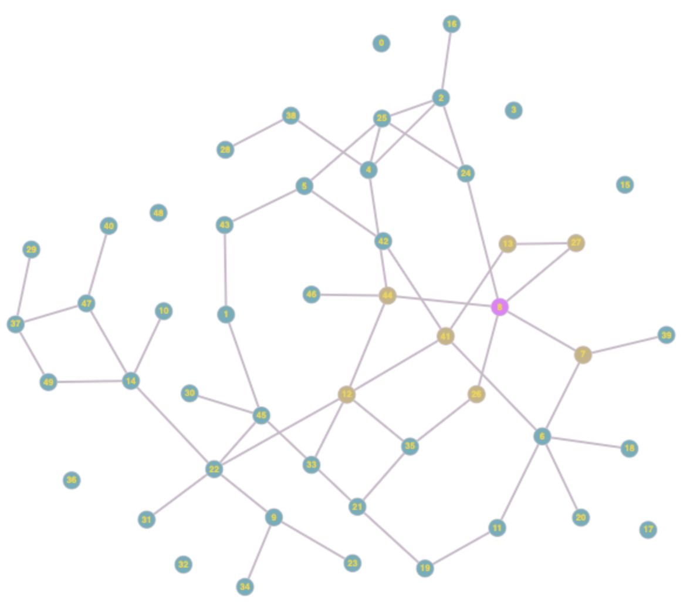

# Graph Library

This is a C++ Graph Library that can be used to implement graph-based programs.
The library supports the creation of nodes, addition and deletion of edges, and can calculate the shortest path between two nodes and
the minimum spanning tree of the graph.

A short sample program is below, and a more detailed sample program is provided in the next section.
```
#include "Graph.h"

int main() {
    Graph g;

    g.setVerbose(true);

    g.addNode();
    g.addNode();
    g.addNode();

    g.addEdge(0, 1, 1);
    g.addEdge(1, 2, 7);

    g.shortestPath(0, 2);
    g.printCSV();
}
```
The short sample program can be executed with the following steps:
1. `make clean`
2. `make test`
3. `./test`

The program's output is as follows:

```
Adding node 0.
Adding node 1.
Adding node 2.
Adding edge from 0 to 1 with weight 1.000000.
Adding edge from 1 to 2 with weight 7.000000.
The shortest path from node 0 to 2 is 8.000000.

0.000000,1.000000,inf,
1.000000,0.000000,7.000000,
inf,7.000000,0.000000,
```


## Sample Program: Infections on a Network
The Graph Library can be used to model an infection spreading through a network.
### Running Instructions
1. `make clean`
2. `make infection`
3. `./infection`

### Description
This sample program creates a random graph with `numNodes` nodes.
A randomly selected node is then infected.
The infection spreads with a defined transmission coefficient and can only be spread to neighbors.
The program first iterates through the initially-infected node's neighbors, infecting them with `transmission_coefficient` probability.
Then, the same occurs to each newly infected node.
Finally, some statistics are printed out.

### Example
This program was run with 50 nodes and a transmission coefficient of 0.3.
The resulting infection graph can be seen below (visualization courtesy of https://graphonline.ru/en/).
The initially infected node is colored pink, and the resultant infected nodes are beige.
In this simulation, 8/50 nodes were infected.
The number of edges is 56.
The average degree of each node is 2.


